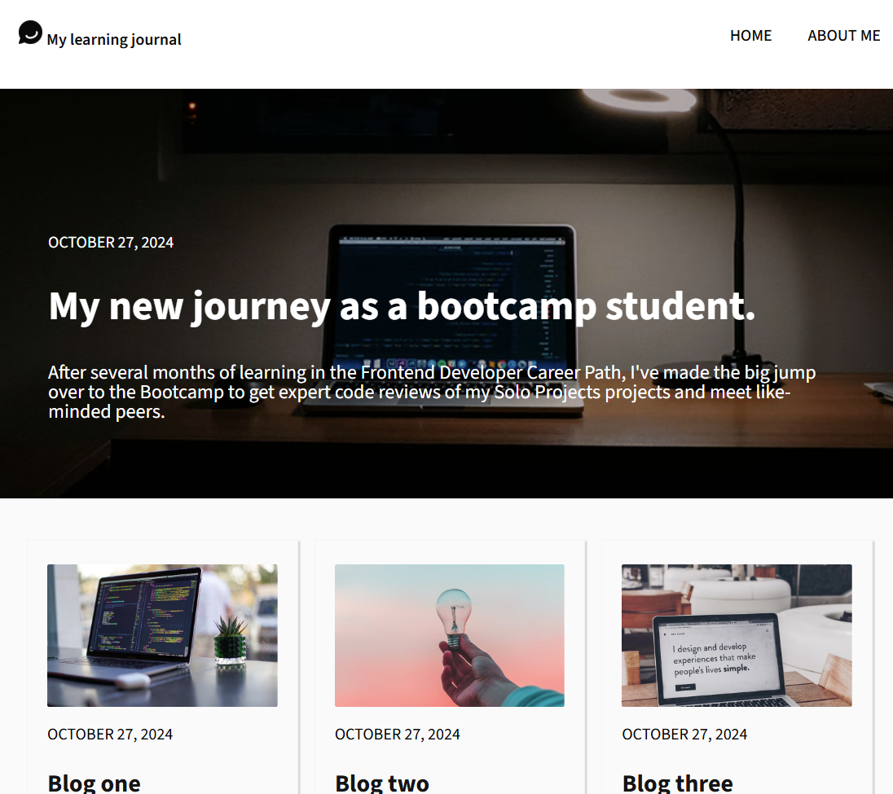
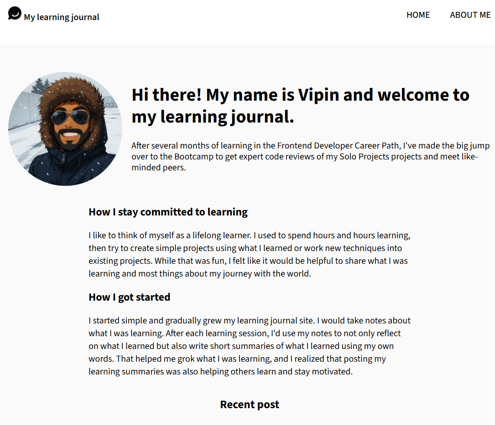

# My Learning Journal

This project is a **Scrimba Solo Project** designed to document and share my learning journey as a frontend developer. The main motivation for this project is to:
- Share experiences and challenges encountered during the learning process.
- Reflect on progress while building and refining web development skills.
- Create a resource that can help both myself and others in the community.

## Project Features
- **Responsive Design:** The project is optimized for various devices using modern CSS techniques.
- **Dynamic Content:** Blog posts are loaded dynamically using JavaScript modules.
- **Clean and Minimalistic UI:** A simple, accessible design focuses on content and readability.

## Technologies Used
- HTML5
- CSS3
- JavaScript (ES6 Modules)
- [Vite](https://vitejs.dev/) for build and development tooling
- Google Fonts

## Setup and Installation
1. Clone or download the repository.
2. Run `npm install` to install dependencies.
3. Use `npm run dev` to start the development server.

## Usage
- Visit the homepage to see the latest blog entries.
- Navigate between pages to get more information about my journey.
- The content is dynamically generated based on the data provided in the JavaScript module.

## Deployment
You can view the deployed site here: [https://cozy-donut-316518.netlify.app/](https://cozy-donut-316518.netlify.app/)

## Screenshots
Below are some screenshots of the project (images available in the `images` folder):

- 
- 

## License
*License information for external libraries and fonts should be verified if used for production.*

## Acknowledgements
- This project is inspired by the Scrimba Solo Projects.
- Thanks to the community and mentors for their continuous support.

Happy coding and learning!